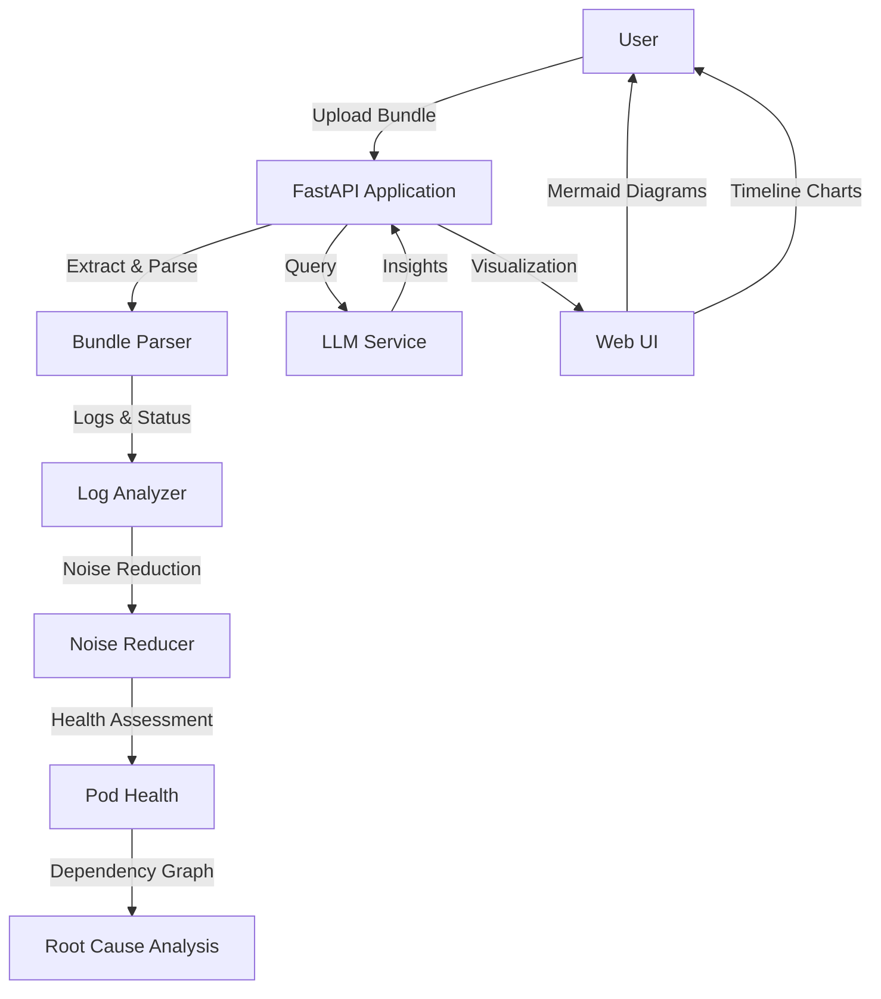

# Failure Analysis Tool

Intelligent log analysis system for Kubernetes clusters that analyzes troubleshoot.sh support bundles to identify issues, root causes, and provide actionable insights.

## What It Does

- **Analyzes log bundles** from troubleshoot.sh support bundles (.tgz files)
- **Reduces noise** by deduplicating logs, filtering irrelevant warnings, and clustering similar errors
- **Identifies root causes** by building dependency graphs and performing temporal correlation
- **Provides insights** via natural language queries using an LLM
- **Visualizes cluster health** with dependency graphs, timelines, and pod status overviews

## Architecture



## Quick Start

### Prerequisites

- Python 3.11+
- Docker (for containerized deployment)
- Kubernetes cluster (for production)
- AWS ECR access (for image registry)

### Local Development

1. **Install dependencies:**
   ```bash
   pip install -r requirements.txt
   ```

2. **Analyze a log bundle:**
   ```bash
   python -m src.cli.main bundle.tgz -o ./output -j analysis_result.json
   ```

3. **Query results (requires LLM model):**
   ```bash
   python -m src.cli.interactive analysis_result.json models/Nemotron-Mini-4B-Instruct-Q4_K_M.gguf
   ```

4. **Run web UI locally:**
   ```bash
   uvicorn src.api.main:app --reload --host 0.0.0.0 --port 8000
   ```
   Open http://localhost:8000

### Kubernetes Deployment

1. **Set environment variables:**
   ```bash
   export AWS_ACCOUNT_ID="your-account-id"
   export AWS_REGION="us-east-2"  # Optional, defaults to us-east-2
   ```

2. **Deploy:**
   ```bash
   ./deploy.sh [namespace] [tag]
   ```

   Example:
   ```bash
   ./deploy.sh failure-analysis-tool v0.1
   ```

3. **Access the application:**
   ```bash
   kubectl port-forward service/log-analysis-aiops-service 8000:8000 -n failure-analysis-tool
   ```
   Open http://localhost:8000

## Usage

### CLI Analysis

Analyze a troubleshoot.sh support bundle:

```bash
python -m src.cli.main bundle.tgz -o ./output -j analysis_result.json
```

Options:
- `-o, --output`: Output directory for extracted bundle
- `-j, --json`: Path to output JSON report
- `--min-warning-frequency`: Minimum frequency for warnings (default: 3)

### Web UI

1. Upload a .tgz bundle file
2. View cluster dependency graph (Mermaid diagram)
3. Explore error timeline
4. Check pod health statuses
5. Ask natural language questions about the analysis

### Natural Language Queries

Examples:
- "Which pods are not working properly?"
- "What is the root cause of the db pod crashing?"
- "Show me connectivity issues"
- "What errors occurred in the last hour?"

## Features

### Intelligent Log Analysis
- Parses diverse log formats (JSON, plain text, multiline stack traces)
- Extracts timestamps, log levels, and messages from various formats
- Handles unstructured logs with content-based level inference

### Noise Reduction
- Deduplicates identical log entries
- Filters irrelevant warnings based on frequency and context
- Clusters similar errors using template extraction
- Collapses repeated errors into single entries with counts

### Root Cause Analysis
- Builds dependency graphs from connectivity issues and service references
- Performs temporal correlation to identify causal relationships
- Distinguishes root causes from symptoms
- Provides confidence scores for root cause identification

## System Requirements

### Development
- Python 3.11+
- 4GB+ RAM
- 5GB+ disk space

### Production (Kubernetes)
- **Recommended instance:** m7i.2xlarge (8 vCPUs, 32GB RAM)
- **Minimum instance:** m7i.xlarge (4 vCPUs, 16GB RAM)
- Persistent volume for LLM model storage (5GB)

## Project Structure

```
fat/
├── src/
│   ├── bundle/          # Bundle extraction and parsing
│   ├── analysis/        # Log analysis, noise reduction, RCA
│   ├── llm/             # LLM integration and query interface
│   ├── api/             # FastAPI backend
│   ├── cli/             # Command-line interface
│   └── models/          # Pydantic data models
├── k8s/                 # Kubernetes deployment manifests
├── frontend/            # Web UI
├── Dockerfile           # Application container image
└── deploy.sh            # Deployment script
```

## License

MIT
